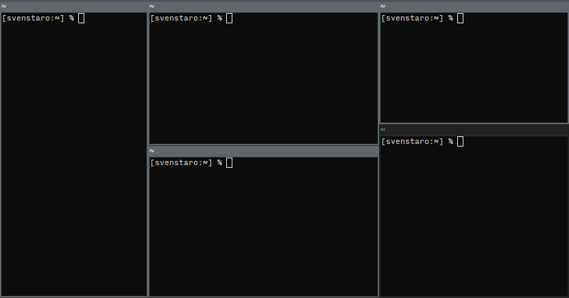

# wmfocus - Visually focus windows by label

[](https://github.com/svenstaro/wmfocus/actions)
[](https://crates.io/crates/wmfocus)
[](https://github.com/svenstaro/wmfocus/blob/master/LICENSE)
[](https://github.com/svenstaro/wmfocus/stargazers)
[](https://github.com/svenstaro/wmfocus)

This tool that allows you to rapidly choose a specific window directly without having to use the mouse or directional keyboard navigation.



Thanks to cairo, it should work on all kinds of screens and automatically display at the correct size according to your DPI.


## Installation

<a href="https://repology.org/project/wmfocus/versions"></a>

**On Arch Linux**: `pacman -S wmfocus`

**With Cargo**: `cargo install --features i3 wmfocus`

## Usage

Draw labels on the upper-left corner of all windows:

    wmfocus

Completely fill out windows and draw the label in the middle (try it with transparency!):

    wmfocus --fill

Use a different font (as provided by fontconfig):

    wmfocus -f "Droid Sans":100

Change up the default colors:

    wmfocus --textcolor red --textcoloralt "#eeeeee" --bgcolor "rgba(50, 50, 200, 0.5)"

wmfocus will make use of a compositor to get real transparency.

## Full help
```
wmfocus 1.4.0

Sven-Hendrik Haase <svenstaro@gmail.com>

Visually focus windows by label

USAGE:
    wmfocus [OPTIONS]

OPTIONS:
        --textcolor <TEXT_COLOR>                          Text color (CSS notation) [default: #dddddd]
        --textcoloralt <TEXT_COLOR_ALT>                   Text color alternate (CSS notation) [default: #666666]
        --bgcolor <BG_COLOR>                              Background color (CSS notation) [default: "rgba(30, 30, 30, 0.9)"]
        --textcolorcurrent <TEXT_COLOR_CURRENT>           Text color current window (CSS notation) [default: #333333]
        --textcolorcurrentalt <TEXT_COLOR_CURRENT_ALT>    Text color current window alternate (CSS notation) [default: #999999]
        --bgcolorcurrent <BG_COLOR_CURRENT>               Background color current window (CSS notation) [default: "rgba(200, 200, 200, 0.9)"]
        --halign <HORIZONTAL_ALIGN>                       Horizontal alignment of the box inside the window [default: left] [possible values: left, center, right]
        --valign <VERTICAL_ALIGN>                         Vertical alignment of the box inside the window [default: top] [possible values: top, center, bottom]
        --fill                                            Completely fill out windows
    -c, --chars <HINT_CHARS>                              Define a set of possbile values to use as hint characters [default: sadfjklewcmpgh]
    -e, --exit-keys <EXIT_KEYS>...                        List of keys to exit application, sequences separator is space, key separator is '+', eg Control_L+g
                                                          Shift_L+f
    -f, --font <FONT>                                     Use a specific TrueType font with this format: family:size [default: Mono:72]
    -h, --help                                            Print help information
    -m, --margin <MARGIN>                                 Add an additional margin around the text box (value is a factor of the box size) [default: 0.2]
    -o, --offset <OFFSET>                                 Offset box from edge of window relative to alignment (x,y) [default: 0,0]
    -p, --print-only                                      Print the window id only but don't change focus
    -V, --version                                         Print version information
```

## Troubleshooting

If there's some funky stuff, you can try to track it down by running `wmfocus` with `RUST_LOG=trace`:

    RUST_LOG=trace wmfocus

This will print quite some useful debugging info.


## Compiling

You need to have recent versions of `rust`, `cargo`, `xcb-util-keysyms`, `libxkbcommon-x11` and `cairo` installed.

Then, just clone it like usual and `cargo run` to get output:

    git clone https://github.com/svenstaro/wmfocus.git
    cd wmfocus
    cargo run --features i3


## Window manager support

While this tool is window manager-independent, an implementation for your favorite window manager might not yet be available. Current support:

- i3
- sway (partial, accepting PRs)

If you want to implement support for more window managers, have a look at the [i3 implementation](https://github.com/svenstaro/wmfocus/blob/master/src/wm_i3.rs).

This tool is heavily inspired by [i3-easyfocus](https://github.com/cornerman/i3-easyfocus).


## Releasing

This is mostly a note for me on how to release this thing:

- `cargo release`
- `cargo release --execute`
- Release will automatically be deployed by GitHub Actions.
- Update Arch package.
